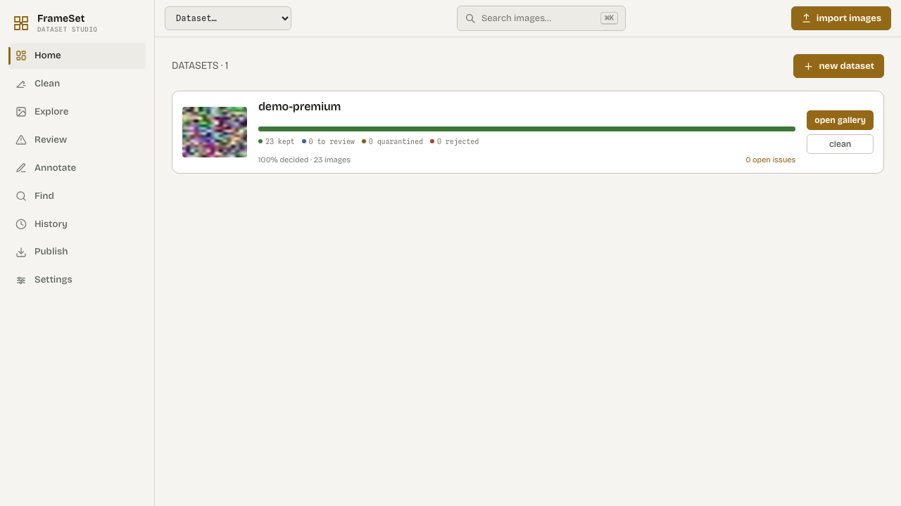
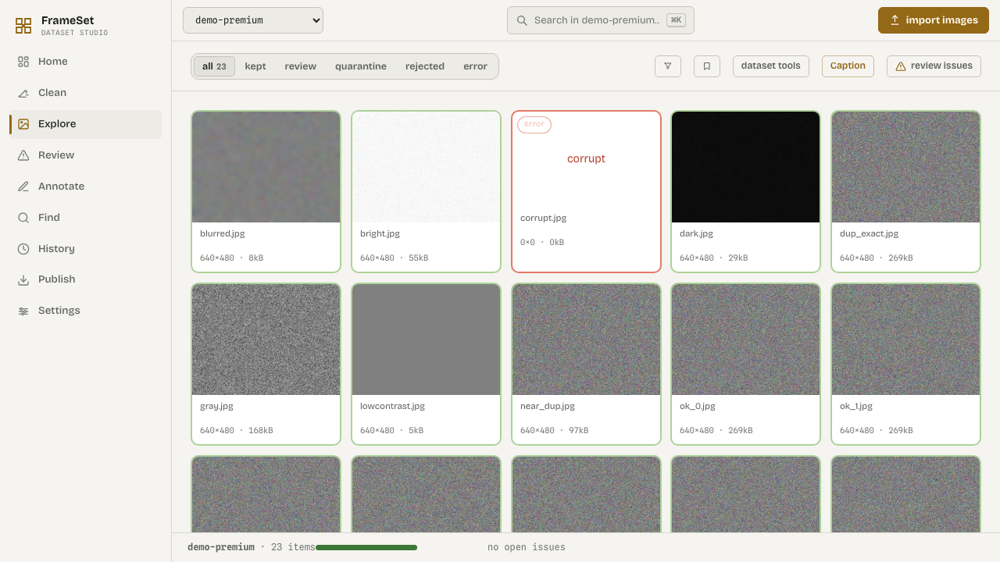
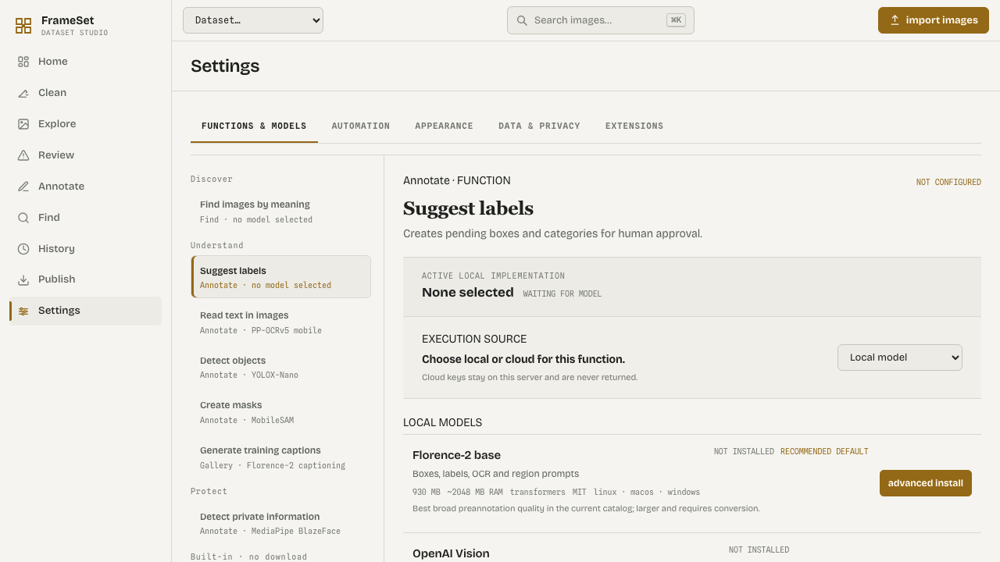

# Images Dataset Studio
[](LICENSE)
[](https://github.com/artificialguybr/images-dataset-studio/releases)

Local-first tooling for building, cleaning, reviewing, annotating, versioning, and exporting image datasets.

The original files stay safe, automated checks stay explainable, and final dataset decisions stay with a human reviewer. The Studio does not train models or hide destructive actions inside an opaque pipeline.

<div align="center">
  
</div>

<p align="center">
  
  
</p>

## Features

- Import folders, ZIP files, ImageFolder, YOLO, COCO, Pascal VOC, ImageNet, and URL manifests.
- Preserve source paths, original bytes, SHA-256 hashes, perceptual hashes, dimensions, thumbnails, and EXIF metadata.
- Review blur, exposure, contrast, entropy, resolution, aspect ratio, grayscale, screenshots, watermarks, and corrupt files.
- Find exact and near duplicates without deleting anything automatically.
- Keep reversible decisions: `keep`, `review`, `quarantine`, `reject`, and `restore`.
- Annotate classifications, bounding boxes, polygons, masks, and keypoints.
- Generate captions, label suggestions, OCR results, detections, masks, and PII issues through local plugins or opt-in cloud providers.
- Search by text or reference image when the optional embedding provider is installed.
- Create immutable versions with manifests, checksums, diffs, and restore support.
- Export ImageFolder, COCO, YOLO, JSONL/CSV manifests, and Parquet datasets.
- Inspect each image with a color RGB histogram, general file facts, adaptive EXIF metadata, labels, quality issues, and decisions.

## Requirements

- Python 3.11+
- [`uv`](https://docs.astral.sh/uv/)
- Node.js 20+ and npm, or [Bun](https://bun.sh/)
- macOS, Linux, or Windows

SQLite is the default local database. GPU support is optional and only needed for selected local ML providers.

## Install and run

Clone the repository and run the same Python command on every supported OS:

```bash
git clone https://github.com/artificialguybr/images-dataset-studio.git
cd images-dataset-studio
python tools/setup.py
cp .env.example .env       # macOS/Linux; copy manually on Windows
python tools/start.py
```

`tools/setup.py` installs backend dependencies with `uv` and frontend dependencies with Bun or npm. `tools/start.py` starts both services, handles Ctrl+C, and works on Windows, macOS, and Linux.

Open <http://127.0.0.1:5199>. The API runs at <http://127.0.0.1:8766>.

### Windows PowerShell

```powershell
py tools\setup.py
Copy-Item .env.example .env
py tools\start.py
```

### macOS/Linux shell convenience

The existing `ids-studio.sh` launcher remains available when a single-process FastAPI preview is preferred:

```bash
./ids-studio.sh
```

Set `IDS_PORT` to change its port. The cross-platform Python launcher is the recommended default because it keeps the API and Vite development server separate.

## Provider configuration

The Settings → Functions & Models screen lets an operator choose local models or cloud providers independently for pre-annotation, captioning, and PII scanning. Each function can use a different provider and model ID. API keys are write-only in the UI and never returned by the API. The local server stores them in `data/provider-settings.json` with owner-only permissions where the platform supports them.

Environment variables remain supported for headless deployments. Copy `.env.example` and set the provider selection, credentials, and default models there.

| Capability | Built-in provider | Setup |
|---|---|---|
| Embeddings and semantic search | `openclip` | `uv sync --extra ml` |
| Pre-annotation, captions, PII | `openai_vision` | OpenAI key + model |
| Pre-annotation, captions, PII | `replicate` | Replicate token + model slug |
| Pre-annotation, captions, PII | `falai` | fal.ai key + model ID |
| Label quality | `cleanlab` | Install `cleanlab` separately |

Cloud adapters use the vendors' server-side APIs. The exact input fields are model-specific; configure a vision model that accepts an image plus prompt. References: [Replicate HTTP API](https://replicate.com/docs/reference/http), [fal.ai model APIs](https://fal.ai/docs/documentation/model-apis/common-parameters).

Provider status is exposed through `GET /api/providers`. An unavailable provider fails the job with an actionable explanation instead of returning fake results.

## MCP

The repository ships an MCP stdio server. Start the API first, then configure an MCP client with [`mcp-config.example.json`](mcp-config.example.json), replacing its `cwd` with the repository path:

```bash
uv run python -m backend.mcp_server
```

The server exposes health, dataset listing/creation, image listing/inspection, image decisions, asynchronous jobs, job status, and exports. It talks to the local REST API, so the same validation and data-safety rules apply. Set `IDS_API_URL` when the API is not on `http://127.0.0.1:8766`.

## Extensions for company models

The repository ships source packs adapted to the image domain:

| Pack | Capabilities |
|---|---|
| `vision-local` | embeddings, detection, segmentation, pre-annotation, captioning |
| `privacy-local` | OCR and image PII detection |

Build platform-specific packs from tracked source:

```bash
uv run python plugins/build_packs.py --target all
```

A company can also ship a self-contained `.pluginpack` without modifying the
Studio core. Install it from Settings → Extensions or `POST /api/plugins/install`.

A pack contains a relative executable and `manifest.json`:

```json
{
  "id": "company-vision",
  "name": "Company Vision",
  "version": "1.0.0",
  "command": ["./run.py"],
  "capabilities": ["preannotation", "captioning"],
  "permissions": ["filesystem:input", "model:cache"]
}
```

The executable is a persistent JSONL process. Each request has this shape:

```json
{"protocol":"ids-plugin.v1","capability":"captioning","payload":{"image_path":"/absolute/path/image.jpg","prompt":"Describe this image"}}
```

Return one JSON object per request:

```json
{"type":"result","output":{"caption":"a red car on a wet street","confidence":0.94}}
```

The runtime validates paths, capabilities, permissions, process boundaries,
timeouts, and output shape. This is the extension seam for private company
models, on-prem inference, or hardware-specific runtimes.

## API

The FastAPI service is the complete integration surface and publishes generated OpenAPI documentation:

- <http://127.0.0.1:8766/docs>
- <http://127.0.0.1:8766/redoc>
- <http://127.0.0.1:8766/openapi.json>

Endpoint groups include health, datasets, imports, jobs, items/files/thumbnails, decisions/tags/licenses, issues, duplicates, labels, captions, versions, semantic search, clusters, derived datasets, exports, provider status/settings, model catalog, plugin installation/invocation, automation, redaction, and cached image inspection assets.

Example:

```bash
curl http://127.0.0.1:8766/api/health
curl http://127.0.0.1:8766/api/datasets
```

## Tests

Run the backend checks directly without an additional test runner:

```bash
uv run python backend/tests/test_units.py
uv run python backend/tests/test_contracts.py
```

Run frontend checks from `frontend/`:

```bash
bun run lint
bun run build
```

## Data safety

- Original source files are never rewritten by analysis or annotation jobs.
- Quarantine is reversible and does not delete source bytes.
- Dataset exports exclude quarantined items.
- Automated analysis creates issues or pending suggestions; a human makes the final decision.
- Import paths, ZIP members, file access, and thumbnail access are validated.
- Runtime data, databases, credentials, caches, and build output are ignored by Git.

## Repository layout

```text
backend/app/          FastAPI application, models, jobs, analyzers, providers, exporters
backend/tests/         Backend unit and contract tests
backend/mcp_server.py MCP stdio server
frontend/src/         React application and visual system
frontend/public/      Static UI assets and reference pages
plugins/              Optional local provider runtimes
tools/                Cross-platform setup and launcher
mcp-config.example.json
ids-studio.sh         Single-process local launcher
pyproject.toml        Python dependencies and optional ML extra
.env.example          Safe configuration template
```

## Scope and limitations

- This is a local single-user application; authentication, multi-user permissions, and collaboration are not included.
- SQLite is the default storage backend. PostgreSQL and distributed workers are outside the current scope.
- Semantic search and clustering require the optional ML extra and appropriate model resources.
- Cloud model inputs vary by provider/model; the configured model must accept the common image-plus-prompt request.
- Cleanlab requires external class-probability data for label-quality analysis.
- The app prepares datasets for external training tools; it is not a training framework.

## License

This project is licensed under the [MIT License](LICENSE).
